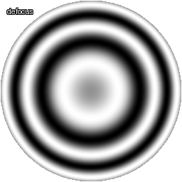
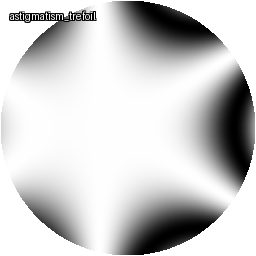

# Optical Aberration Database Generator

## Descripción
Sistema para generar datasets sintéticos de aberraciones ópticas simuladas mediante polinomios de Zernike, con capacidad de añadir ruidos físicamente realistas.  

**Características clave**:  
- **Simulación física precisa**: Interferogramas de aberraciones ópticas personalizables usando polinomios de Zernike
- **Control detallado**: EL sistema está diseñado para:  
  - Combinar múltiples modos de aberración  
  - Parametrizar coeficientes y muestras por clase  
  - Reproducir experimentos mediante semillas
  *(Ver [Configuraciones Avanzadas](docs/configs_spects.md))*  
- **Ruidos realistas**: [Modelos físicos documentados](docs/noise_models.md) con control de:  
  - Intensidad de ruido (σ gaussiano, densidad de polvo, de Poisson)  
  - Perfiles de movimeinto (vibración mecánica)  

## Conjuntos de Datos Disponibles

El repositorio incluye actualmente dos tipos de datasets pregenerados para distintos casos de uso:

### 1. Aberraciones Puras (`data/pure_aberrations`)
Contiene interferogramas con modos Zernike individuales, ideales para:
- Entrenamiento de modelos de clasificación
- Estudio de aberraciones aisladas
- Calibración de sistemas ópticos

{: width="250"}

*Dataset generado con la configuracion en configs/pure_aberrations.yaml*

---

### 2. Aberraciones Mixtas (`data/mixed_aberrations`)
Combina múltiples modos Zernike con ruido físico, diseñado para:
- Simulación de condiciones realistas
- Validación de algoritmos de reconstrucción

{: width="250"}
*Dataset generado con la configuracion en configs/mixed_aberrations.yaml*

**Características comunes**:
- Formato: TIFF 16-bit (512×512px)
- Metadatos: Incluyen coeficientes Zernike exactos
- Métricas: 20+ parámetros de calidad óptica ([detalles](docs/metrics_details.md))

## Instalación
```bash
git clone https://github.com/isaultirado77/optical_aberration_database.git
cd optical_aberration_database
pip install -r requirements.txt
```

## Estructura del Proyecto
```
├── configs/                   # Plantillas YAML de configuración
├── data/                      # Datasets generados
├── examples/                  # Ejemplos de uso
├── src/
│   ├── aberrations/           # Generación de aberraciones
│   ├── metrics/               # Cálculo de métricas
│   └── scripts/               # Scripts CLI para generación y preprocesamiento
├── visualization/             # Animaciones y gráficos
├── tests/                     # Pruebas unitarias
└── docs/                      # Documentación técnica
```

## Uso Básico
### Generación de Datasets
```bash
# Dataset básico
python -m src.scripts.generate_dataset \
    -c configs/pure_aberrations.yaml \
    -o data/pure_aberrations

# Configuración personalizada
python -m src.scripts.generate_dataset \
    --config configs/demo.yaml \
    --output data/demo_output\
    --seed 42
```

### Preprocesamiento
```bash
python -m src.scripts.preprocess_data \
    --input_dir data/demo_output/raw \
    --output_dir data/demo_output/processed \
    --config configs/preprocess_config.yaml
```
*Consular la [documentación](docs/dataset_spects.md) para detalles generación y procesamiento de datos.*

## Métricas Generadas
El sistema calcula automáticamente 20+ métricas por imagen, incluyendo:  

| Categoría          | Métricas Clave | Documentación |
|--------------------|----------------|---------------|
| Estadísticas       | Entropía, Curtosis | [Detalles](docs/metrics_details.md) |
| Calidad Óptica     | Strehl Ratio, RMS | [Teoría](docs/optical_aberrations.md) |
| Texturas           | Haralick Features | [Referencia](docs/dataset_spects.md) |

## Documentación Técnica

- [Teoría de Polinomios de Zernike](docs/optical_aberrations.md)  
  Fundamentos matemáticos de los polinomios de Zernike y su relación con aberraciones ópticas clásicas (defocus, astigmatismo, coma, etc.).

- [Modelos de Ruido](docs/noise_models.md)  
  Implementación física de 4 tipos de ruido:  
  - Gaussiano (electrónico)  
  - Poisson (cuántico)  
  - Partículas de polvo  
  - Vibración mecánica  
  *Incluye interpretación física y descripcion de parámetros de configuración*.

- [Especificación de Datasets](docs/dataset_spects.md)  
  Estructura completa de archivos generados:  
  - Formato TIFF 8-bit  
  - Metadatos técnicos (YAML)  
  - Métricas en CSV  
  - Jerarquía de directorios recomendada.

- [Configuraciones Avanzadas](docs/configs_spects.md)  
  Guía detallada de archivos de configuración YAML para:  
  - Combinación de modos Zernike (`coefficients`)  
  - Perfiles de ruido (`noise_profiles`)  
  - Metadatos de simulación (`metadata`)  

- [Referencia de Métricas](docs/metrics_details.md)  
  Catálogo de 20+ métricas calculadas automáticamente:  
  - **Estadísticas**: Entropía, curtosis, energía  
  - **Calidad óptica**: RMS, Strehl ratio, PSNR  
  - **Texturas**: Características de Haralick  
  *Con fórmulas matemáticas y rangos típicos*.

- [Modos Zernike e Implementación](docs/zernike_modes_reference.md)  
  Detalles técnicos del generador de interferogramas:  
  - Ejemplos de código para combinaciones complejas  
  - Visualización de frentes de onda  


## Contribución
1. Haz fork del proyecto
2. Crea una rama (`git checkout -b feature/nueva-aberracion`)
3. Haz commit de tus cambios (`git commit -m 'Añade soporte para X'`)
4. Haz push a la rama (`git push origin feature/nueva-aberracion`)
5. Abre un Pull Request

## Licencia
Creative Commons Attribution-NonCommercial-ShareAlike 4.0 (CC-BY-NC-SA-4.0)